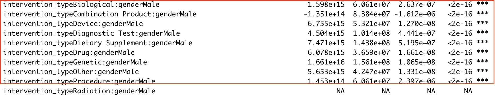
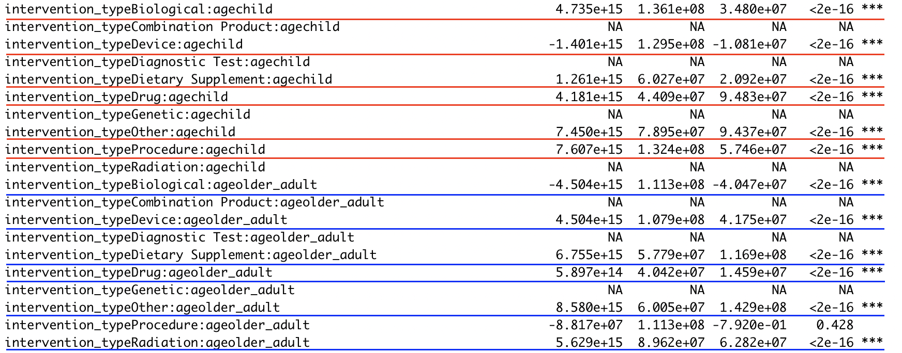

### Author: Chengxi Wang cw973 & Yun Yang yy643

```{r, include = FALSE}
devtools::load_all()
library(DBI)
library(duckdb)
library(dplyr)
library(gridExtra)
library(dbplyr)
```

```{r setup}
library(bis620.2022)
```

# 1. Background and Motivation
In our midterm project, we made shiny apps based on the `ctgov` dataset, which contains 54 tables that record information of clinical trials including sponsorship, designs, outcomes and so on. After reiewing the whole dataset and understanding the meaning of each table, we decided to focus our final study on the `reported_events_total` table, which contain information of the occurrence of adverse events during clinical trials.

As described by the U.S. Department of Health and Human Services, adverse events are events in which medical care "resulted in an undesirable clinical outcome." Such outcomes should not be caused by the underlying disease. As the outcomes could bring about permanent harm to the patient and some adverse events are even more serious than the disease itself, this motivates us to think about the possible factors that may lead to these adverse events. According to FDA, the occurrence of adverse events is a reaction to certain medical treatments and vary from individual to individual. Therefore, if we could better understand how medical intervention is associated with adverse events and what type of patients are most susceptible in having adverse events, we may make recommendations to healthcare providers in avoiding applying certain interventions to patient with certain characteristics, in order to reduce the risk of having adverse events.

# 2. Research Question
How does the type of intervention affect the occurrence of adverse events in populations of different genders, ages, and health conditions? On this basis, what insights can we draw on choosing an appropriate intervention type in medical treatment for different groups of patients, in order to reduce their affected rate?

# 3. Data Cleaning and Exploration

## Data Introduction
We are going to use the ‘ctgov’ data set, which provides data retrieved from ClinicalTrials.gov. Each table in the data set includes the unique identifier assigned by ClinicalTrials.gov: nct_id. The main table in the ‘ctgov’ schema is 'studies' which relates to all other ‘ctgov’ tables through the nct_id. This provides a way to find all data about a particular study and serves as the key that joins related information across multiple tables. Every table (except Studies) also includes an id column which uniquely identifies each row in the table. 

The three main tables used are `reported_event_totals`, `interventions` and `eligibilities`: `reported_event_totals (re)` contains summary information about reported adverse events, including subjects affected and subjects at risks; `interventions (intervention)` contains the interventions or exposures (including drugs, medical devices, procedures, vaccines, and other products) of interest to the study, or associated with study arms/groups; `eligibilities (eg)` contains information about the criteria used to select participants.

Links to information about the data if needed e.g. package vignettes. You can use this link to see to see [`ctgov`](https://github.com/RitaYY1999/bis620.2022/tree/main/vignettes) dataset.
```{r message=FALSE, warning=FALSE, error=FALSE}
re = read.table(file.path("ctrialsgovdownload","reported_event_totals.txt"), sep="|", quote="", comment.char="", header = TRUE)
intervention = read.table(file.path("ctrialsgovdownload","interventions.txt"), sep="|", quote="", comment.char="", fill = TRUE, header = TRUE)
eg = read.table(file.path("ctrialsgovdownload","eligibilities_new.txt"), sep = "|", fill = TRUE, header = TRUE, quote = "")
```
## Data Cleaning
First, let us apply the `event_preprocess` function from our own package to conduct data-cleaning. It consists of tree steps:
1) Convert table into data frame for us to analyze more conveniently.
2) Drop all rows with NA values to make sure all our data used are valid.
3) Add a column named `affected_rate`, which is calculated by `subjects_affected`/`subjected at risk`. This `affected_rate` is the dependent variable in our study, and it measures the level of patient being affected by negative effect of the medical care.
```{r, warning=FALSE, error=FALSE}
df_re = event_preprocess(re)
```

## Data Exploration

### affected_rate v.s. intervention_type
Then, by joining the `df_re` table with the `intervention` table, we are able to give out the summary statistics of the `affected_rate` for each `intervention_type` and make some visualizations to see whether there's a difference. Here we apply our functions `summary_stats` to make summary of statistics and functions `box_plot` and `mean_plot` to make visualizations.
```{r, warning=FALSE, error=FALSE}
intervention <- as.data.frame(intervention)
event_intervention = df_re |>
  inner_join(intervention, by = "nct_id") |>
  select(nct_id, affected_rate, intervention_type)
event_intervention$intervention_type <- as.factor(event_intervention$intervention_type)
summary_stats(event_intervention)
```
```{r, fig.width=7, fig.height=3, warning=FALSE, error=FALSE}
box_plot(event_intervention)
mean_plot(event_intervention)
```
### affected_rate v.s. gender
According to the summary of statistics, box plot and mean plot, we can identify that `affected_rate` vary from different intervention types. Among them, `behavioral` intervention has the smallest average `affected_rate` of 4.8%, and `genetic` intervention has the greatest average `affected_rate` of 43.5%. 

To study the association between `gender` and `affected_rate`, we first drop all the rows with unspecified gender types and NAs. We then join it with the `df_re` table to summarize their statistics and make visualizations.
```{r, warning=FALSE, error=FALSE}
e_gender <- as.data.frame(eg) |>
  filter(gender != "All")
event_gender = df_re |>
  inner_join(e_gender, by = "nct_id") |>
  select(nct_id, affected_rate, gender) |>
  filter(!is.na(gender))
event_gender$gender <- as.factor(event_gender$gender)
summary_stats(event_gender)
```
```{r, fig.width=7, fig.height=3, warning=FALSE, error=FALSE}
grid.arrange(box_plot(event_gender), mean_plot(event_gender), ncol = 2)
```

According to the summary of statistics, box plot and mean plot, we can identify that `male` patients have a slightly higher `affected_rate`, compared with `female` patients. Further statistical tests should be conducted to verify whether such difference is significant.

### affected_rate v.s. age_type
To study the association between `age_type` and `affected_rate`, we first drop all the rows with mixed age groups and label the rest by `child`, `adult` and `older_adult`. We then join it with the `df_re` table to summarize their statistics and make visualizations.
```{r, warning=FALSE, error=FALSE}
age_type = as.data.frame(eg) |> mutate(age = case_when(older_adult == "t" & child == "f" & adult == "f" ~ "older_adult",
                                           older_adult == "f" & child == "t" & adult == "f" ~ "child",
                                           older_adult == "f" & child == "f" & adult == "t" ~ "adult",
                                          TRUE ~ "other"))|>
  select(nct_id, age)
age_event = df_re |>
  inner_join(age_type, by = "nct_id") |>
  select(nct_id, affected_rate, age) |>
  filter(age != "other")
age_event$age <- as.factor(age_event$age)
summary_stats(age_event)
```
```{r, fig.width=7, fig.height=3, warning=FALSE, error=FALSE}
grid.arrange(box_plot(age_event), mean_plot(age_event), ncol = 2)
```

According to the summary of statistics, we can identify that `older_adult` has the highest average `affected_rate` of 21.6%, while `adult` has the lowest of 13.5%. Both box plot and mean plot show that there's a difference in `affected_rate` between different age groups.

### affected_rate v.s. health
To study the association between `health` condition and `affected_rate`, we first label each row with `Yes` and `No` given their information of whether that study accepts healthy volunteers, and drop all the rows with unknown values. We then join it with the `df_re` table to summarize their statistics and make visualizations.
```{r, warning=FALSE, error=FALSE}
health_condition = as.data.frame(eg) |> select(nct_id, healthy_volunteers)|>
  mutate(health = case_when(healthy_volunteers == "No" ~ "No",
                            healthy_volunteers == "Accepts Healthy Volunteers" ~ "Yes",
                            TRUE ~ "Unknown")) |> filter(healthy_volunteers != "Unknown")
health_event = df_re |>
  inner_join(health_condition, by = "nct_id") |>
  select(nct_id, affected_rate, health) |>
  filter(health != "Unknown")
health_event$health <- as.factor(health_event$health)
summary_stats(health_event)
```

```{r, fig.width=7, fig.height=3, warning=FALSE, error=FALSE}
grid.arrange(box_plot(health_event), mean_plot(health_event), ncol = 2)
```

According to the summary statistics and plots, we can identify that studies with healthy volunteers have a higher average `affected_rate` then studies without healthy volunteers.

# 4. Analysis

## Assumptions

- Intervention types, genders, ages and health conditions are associated with the adverse event.

- There are significant differences in adverse event affected rates for patients treated with different intervention types.

## Model and Summary Statistics

Based on the previous ANOVA test, we could see that intervention types, genders, ages and health conditions are variables of great importance in deciding the adverse event affected rates.

We can further investigate in detail how those factors are associated with the seriousness of adverse event. We try to transform the numerical adverse event rates into a dummy variable `adverse_status`. For serious adverse event (affected rate > 10%), we denote it as status 1, otherwise as status 0. We further choose logistic regression model without interaction terms to test the associations. Since as shown in the previous boxplots and meanplots, the `Behavioral` intervention type differs the most from other intervention types in terms of adverse event affected rates, we set it as the default comparing variable in intervention type factor in logistic regression model. For gender factor, the default comparing variable is `Female`. For age factor, the default comparing variable is `Adult`. The resulting summary statistics are:

```{r message=FALSE, warning=FALSE, error=FALSE}
regression_model(re, eg, intervention, "without")
```

To see whether there are significant differences in adverse event affected rates for patients treated with different intervention types and how could this further offer insights on choosing an appropriate intervention type to reduce the affected rate in adverse events for different types of patients, we further apply logistic regression model with interaction terms among all factors. Since the summary output is quite long with some useless rows, we hide the results here and will show important part of them in the next section.

```{r echo = T, results = 'hide', message=FALSE, warning=FALSE, error=FALSE}
regression_model(re, eg, intervention, "with")
```


# 5. Interpretation and Conclusions

## Interpretation
From the result without interaction terms, we could see that our assumption that intervention types, genders, ages and health conditions are associated with the seriousness of adverse event is verified. More specifically, for healthy participants, they are less likely to have serious adverse event than unhealthy individuals, which makes perfect sense. For children and older adults, they are more likely to have serious adverse event than adults. As for intervention type factor, biological intervention and drug intervention are of great importance in affecting the adverse event. Additionally, compared to behavioral intervention, they are much more likely to result in serious adverse event. 

From the result with interaction terms among all factors, we could further see the influence of intervention types on adverse event seriousness with different groups of people. "NA" rows in the summary statistics mean there are collinearity issues in the matrix, which indicate that they do not offer additional useful information of adverse event and the corresponding interactions has no significant effects on adverse event seriousness. Thus, we only consider rows without "NA" and obviously they have pretty low p-values. Since practically we do not offer interventions to healthy populations, we ignore the interaction terms with health conditions. Therefore, the main parts to interpret are as below:

### intervention_type v.s. gender
```{r, out.width="90%"}

```
Compared with female patients treated with behavioral intervention, male patients treated with combination product intervention are more prone to serious adverse event. At the same time, male patients treated with biological, device, diagnostic test, dietary supplement, drug, genetic, procedure and other interventions have more optimistic outcomes in terms of the adverse event seriousness.

### intervention_type v.s. age

```{r, out.width="90%"}

```
Compared with adult patients treated with behavioral intervention, children treated with biological, dietary supplement, drug, procedure and other interventions are more prone to adverse event and children treated with device interventions have less serious adverse event. For older adult, they are more likely to have serious adverse events when treated with biological intervention and less likely to result in serious adverse events when treated with device, dietary supplement, drug, radiation and other interventions.

## Conclusions

In conclusion, intervention types, genders, ages and health conditions are associated with the adverse event affected rate. Their associations give insights on intervention type decision making for different groups of patients to reduce adverse event affected rate and seriousness.

Healthy people are less likely to have adverse event than people with underlying disease. Adults are less likely to have serious adverse event than children or older adults. Biological and drug interventions are more likely to result in serious adverse event than behavioral intervention. 

For male patients, we may select biological, device, diagnostic test, dietary supplement, drug, genetic and procedure intervention to reduce adverse event affected rates. For children, we may choose device intervention. While for older adults, we need to avoid biological intervention and adopt device, dietary supplement, drug and radiation interventions to improve adverse event outcomes.

Our analysis has limitations. The default comparing variables in logistic regression models are fixed according to our own understanding about the issues, which limits our ability to fully investigate the intervention effects on adverse event affected rates in different groups. Additionally, the interactions among intervention, age and gender are not fully explored. Further research could be done to solve these limitations. 

